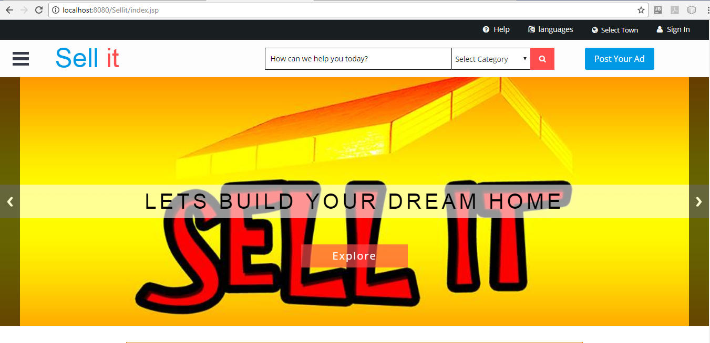

# Sellit

This project facilitates the user to advertise his/her products or services. The sellers advertise and sell their products while the buyers search their desired category easily and buy the products. As well, the advertisers can logged into the system and view their profile, view their advertisements and to change settings. In order to post your advertisement, the user have to essentially logged into the system. 

### Getting Started
#### Prerequisites
GlassFish Server 4.1
MySQL server
#### Installing
You simply need to download this project and export to any IDE such as Netbeans, Eclipse or InteliJEDIA. 

### Built With
JSP and Servlet
Java 
Hibernate Framework
JQuery
MySQL database

### Versioning
We use Github for versioning. 

### How the System Works

